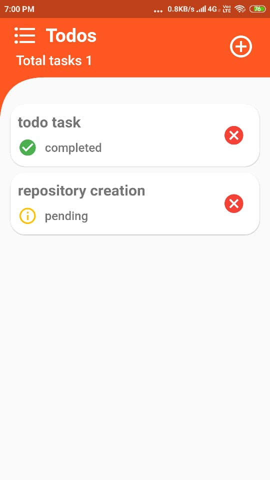
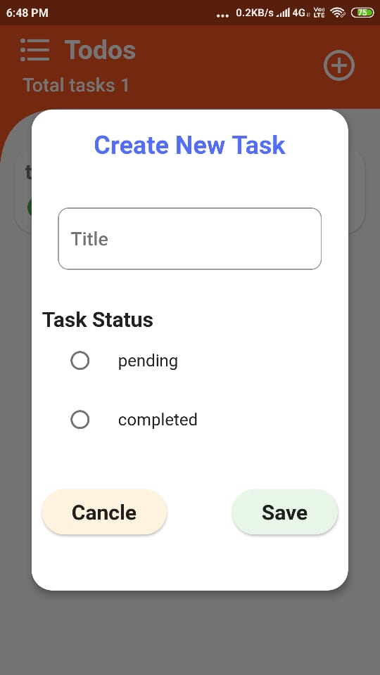

# todotask

A new Flutter Todey application.

### App screens

list of tasks screen |create new task screen | edit screen
:-------------------------:|:-------------------------:|:-------------------------:
 |   | 
 Next click on the add button (+) symbol to create new task || next click on the task come  to this screen to edit

##### Install the app,test yourself and feel free to comment

# Technology stack 

1. Flutter Framwork [documentation](https://flutter.dev/docs), which offers tutorials,
samples, guidance on mobile development, and a full API reference.

## Getting Started

This project is a starting point for a Flutter application.

A few resources to get you started if this is your first Flutter project:

- [Lab: Write your first Flutter app](https://flutter.dev/docs/get-started/codelab)
- [Cookbook: Useful Flutter samples](https://flutter.dev/docs/cookbook)

### Our Project Dependencies:

1. ###### I'm using Hive Database for storing the todo's   

    1. [hive](https://pub.dev/packages/hive#-readme-tab-) Hive is a lightweight and blazing fast key-value database written in pure Dart. By using this package we can perform the database operations.
    2. [hive_flutter](https://pub.dev/packages/hive_flutter) package it gives the support to hive package.
    3. [hive_generator](https://pub.dev/packages/hive_generator) package(dev dependency) for generating the custom objects for hive database.
    4. [build_runner](https://pub.dev/packages/build_runner) package provides a concrete way of generating files using Dart code. 
    5. [path_provider](https://pub.dev/packages/path_provider) package to getting the directory path(Location) for the hive database to store the todo's

Thank you 😍️😍️😍️
 
